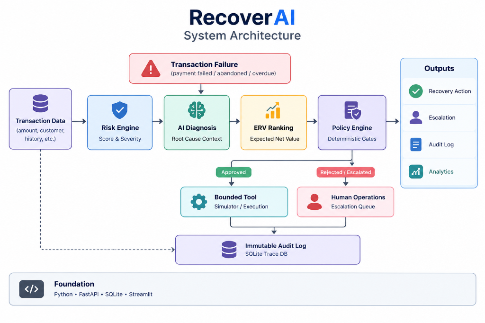

# RecoverAI: Bounded Autonomous Revenue Recovery System

> **Live Operations Control Room**: [https://adithyaabburi-recoverai-dashboardapp-aqo2hr.streamlit.app](https://adithyaabburi-recoverai-dashboardapp-aqo2hr.streamlit.app)

RecoverAI is an AI-powered revenue recovery system designed for enterprise payment operations. It detects payment failures, diagnoses root causes using generative AI context parsing, optimizes recovery paths through Expected Recovery Value (ERV) mathematical ranking, and executes bounded recovery actions under strict deterministic safety guardrails.

---

## Executive Summary & Benchmark Metrics

RecoverAI was evaluated on a canonical benchmark of 1,000 synthetic transaction failures under fixed random seeds (`seed=42`). All metrics below represent the single source of truth exported to `data/evaluation/evaluation_results.json` and rendered across the Streamlit Operations Control Room:

| Metric | Naive Baseline (Retry-Once) | Rules-Only (Static Mapping) | RecoverAI Agent (AI-Optimized) |
| :--- | :--- | :--- | :--- |
| **Total Transactions Evaluated** | 1,000 | 1,000 | 1,000 |
| **Transactions Successfully Recovered** | 321 / 1,000 | 515 / 1,000 | **661 / 1,000** |
| **Transaction Recovery Rate** | 32.1% | 51.5% | **66.1%** |
| **Revenue at Risk** | INR 14,648,500.39 (₹146.49L) | INR 14,648,500.39 (₹146.49L) | INR 14,648,500.39 (₹146.49L) |
| **Gross Revenue Recovered** | INR 4,292,057.07 (₹42.92L) | INR 6,815,233.05 (₹68.15L) | **INR 8,647,258.31 (₹86.47L)** |
| **Revenue Recovery Rate** | 29.30% | 46.53% | **59.03%** |
| **Recovery Operational Cost** | INR 839.00 (₹0.01L) | INR 24,772.00 (₹0.25L) | INR 34,795.00 (₹0.35L) |
| **Net Revenue Recovered** | INR 4,291,218.07 (₹42.91L) | INR 6,790,461.05 (₹67.90L) | **INR 8,612,463.31 (₹86.12L)** |
| **Financial Net Uplift (vs Baseline)** | — | +17.22% (+INR 2,499,242.98) | **+29.73% (+INR 4,355,201.24 / +₹43.55L)** |
| **Financial Net Uplift (vs Rules-Only)**| — | — | **+12.51% (+INR 1,832,025.26 / +₹18.32L)** |
| **Average Attempts per Transaction** | 0.84 | 1.35 | 1.53 |
| **Escalated Cases (Ops Queue)** | 0 (No escalation) | 242 (24.2%) | 339 (33.9%) |
| **Policy Violation Rate** | 0.0% | 0.0% | **0.0% (100% Compliant)** |
| **Stopping Rule Compliance** | 100.0% | 100.0% | **100.0% (MAX_ATTEMPTS=2 Enforced)** |

*Note: Transaction recovery rate measures count of resolved transactions, while revenue recovery rate measures financial value recovered from total revenue at risk. Dashboard KPI cards display values formatted in Lakhs (₹L) for executive control room view.*

---

## Operations Control Dashboard Architecture & Functionality

The Streamlit Operations Control Room provides payment operations teams with real-time visibility and auditability over the autonomous recovery process:

1. **Executive KPI Banner**: Displays live financial metrics including Total Revenue at Risk, Gross Recovered Revenue, Net Recovered Revenue (after deducting action operational costs), and Financial Uplift vs static rule benchmarks.
2. **Comparative Financial Charts**: Renders side-by-side visual comparisons of Gross vs Net Recovery across baseline, static rules, and RecoverAI strategies, along with human-readable intervention action distribution bar charts.
3. **End-to-End Recovery Pipeline Funnel**: Displays transaction state transitions from ingestion, AI evaluation, intervention selection, successful recovery, to human escalation.
4. **Safety & Stopping Rule Verification**: Confirms strict enforcement of `MAX_ATTEMPTS = 2` stopping rules (Attempt 1 and Attempt 2 execution, Attempt 3 blocking) with zero policy violations.
5. **System Latency & Performance Breakdown**: Logs stage-by-stage execution latencies (Risk Scoring, Root Cause Analysis, Policy Guardrails, Execution). *Note: Measured local pipeline stages remain sub-millisecond in the benchmark environment; external gateway and network latencies are excluded.*
6. **Interactive AI Decision Trace & Audit Viewer**: Enables deep-dive inspection into individual transactions (e.g. `TX00014`), displaying initial payment status (`FAILED`), recovery status (`RECOVERED` / `UNRECOVERED` / `ESCALATED` / `STOPPED`), AI root cause diagnosis, ERV candidate rankings, policy gate decisions, tool execution outcomes, and complete Transaction Audit Trail timelines.

---

## System Architecture & Data Lifecycle

RecoverAI implements a hybrid architecture: generative AI diagnoses context, while mathematical optimization and compiled Python rules bound financial execution.



### Architectural Pipeline Details

1. **Transaction Data Ingestion**: Collects transaction details (amount, customer profile, payment history, overdue invoice context).
2. **Risk Engine (Score & Severity)**: Computes a business risk score (0-100) based on transaction value, customer LTV, historical success rate, and overdue invoice age.
3. **AI Diagnosis (Root Cause Context)**: Analyzes contextual data to identify underlying causes (e.g. temporary bank timeouts vs chronic liquidity issues) beyond surface failure codes.
4. **ERV Ranking (Expected Net Value)**: Ranks candidate recovery interventions by maximizing Expected Net Recovery:
   $$\text{Expected Net Recovery} = (\text{Success Probability} \times \text{Recoverable Amount}) - \text{Operational Cost}$$
5. **Policy Engine (Deterministic Gates)**: Validates actions against strict safety guardrails (retry cap `MAX_ATTEMPTS = 2`, high-value threshold $\ge$ INR 25,000 escalation, fraud risk flag blocking, communication opt-out compliance).
6. **Bounded Tool Execution (Approved Branch)**: Executes approved interventions within a seeded payment simulator.
7. **Human Operations Escalation (Rejected/Escalated Branch)**: Safely routes high-value, fraud-flagged, or retry-exhausted cases to manual review queues.
8. **Transaction Audit Trail (SQLite DB)**: Records a step-by-step trace of every decision stage for compliance, governance, and operational analytics.

### Data Model & Lifecycle Semantics

* **Initial Payment Status (`status`)**: Permanent and immutable (`FAILED`) for all failed transactions entering the recovery pipeline.
* **Recovery Status (`recovery_status`)**: Tracks the outcome of the recovery execution (`UNRECOVERED`, `RECOVERED`, `ESCALATED`, `FAILED`, `STOPPED`).
* **Recovered Amount (`recovered_amount`)**: Tracks net funds recovered (`INR 0.00` if unrecovered, or `transaction.amount` if recovered).

---

## Codebase Structure

```
RecoverAI/
├── app/
│   ├── main.py                 # FastAPI Web API
│   ├── config.py               # Env Configuration
│   ├── agent/                  # Orchestrator, ERV engine, tools, prompts, schemas
│   ├── risk/                   # Transaction Risk Scoring Engine
│   ├── diagnosis/              # LLM root-cause analyzer & deterministic fallback
│   ├── policy/                 # Hardcoded business policy guardrails
│   ├── simulator/              # Seeded repeatable payment simulator
│   ├── services/               # DB and audit services
│   └── db/                     # DB schemas and database session setup
├── dashboard/                  # Streamlit Operations Control Room (app.py)
├── data/
│   ├── generated/              # Synthetic CSV datasets
│   └── evaluation/             # Canonical evaluation JSON & CSV results
├── scripts/                    # CLI tools (generate_data.py, run_batch.py, run_evaluation.py, evaluate.py)
├── tests/                      # Pytest automation suite (37 automated unit & integration tests)
└── docs/                       # Architectural & evaluation details
```

---

## Quick Start and Local Reproduction

### 1. Prerequisites
- **Python**: 3.11+ installed.
- **Ollama (Optional for local LLM)**: Pull model prior to running active inference:
  ```bash
  ollama pull deepseek-coder:6.7b
  ```

### 2. Installation
```bash
pip install -r requirements.txt
cp .env.example .env
```

### 3. Run Automated Test Suite (37 Passed)
```bash
pytest
```

### 4. Reproduce Canonical Evaluation (1,000 Transactions)
```bash
python scripts/run_evaluation.py --count 1000 --llm-limit 2
```

### 5. Launch Operations Dashboard
```bash
streamlit run dashboard/app.py
```

### 6. Launch FastAPI Backend
```bash
python -m uvicorn app.main:app --reload
```

---

## Public Cloud Deployment & Resume Linking

This interactive dashboard is deployed live on **Streamlit Community Cloud** and accessible globally:

* **Live Control Room URL**: [https://adithyaabburi-recoverai-dashboardapp-aqo2hr.streamlit.app](https://adithyaabburi-recoverai-dashboardapp-aqo2hr.streamlit.app)
* **GitHub Repository**: [https://github.com/AdithyaAbburi/RecoverAI](https://github.com/AdithyaAbburi/RecoverAI)

### Resume / Portfolio Format
```text
RecoverAI | Bounded Autonomous Revenue Recovery System
• Architected a hybrid AI revenue recovery agent combining local LLM root-cause diagnosis with Expected Recovery Value (ERV) mathematical ranking and deterministic safety policy guardrails.
• Evaluated on a 1,000 synthetic transaction failure benchmark, achieving 59.03% revenue recovery rate (INR 86.12 Lakhs net) with +12.51% net financial uplift over static rules and 0% policy violations.
• Built operations control dashboard using Streamlit and REST API using FastAPI with full automated pytest coverage (37 tests passing).
• GitHub: https://github.com/AdithyaAbburi/RecoverAI | Live Demo: https://adithyaabburi-recoverai-dashboardapp-aqo2hr.streamlit.app
```

---

## Core Safety Controls & Limitations

* **Deterministic Policy Gates**: LLMs produce natural language reasoning, but cannot directly execute financial actions. Interventions are passed through compiled Python guardrail checks before tool execution.
* **Stopping Rule Enforcement**: Capped at `MAX_ATTEMPTS = 2`. Automated retries are terminated after 2 attempts, routing unresolved cases to human operations with 0 stopping-rule violations.
* **Simulation Scope**: Transaction datasets and payment processor responses are generated within a seeded simulator to ensure repeatable evaluation. Real third-party payment gateway endpoints are not invoked.
